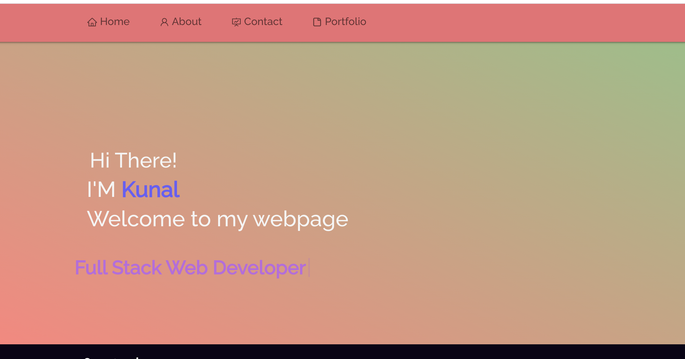

# kp-portfolio

## Table of Contents

- [Description](#description)
- [Installation](#installation)
- [Technologies Used](#technologies)
- [Link](#link)

## Description

A online portfolio using React.

## Installation

The following steps were undertaken to create this program

- Create and download the repository in gitHub
- Open VS Code

  - Execut Create React App: Run npx create-react-app <appname>

- React downloads many dependencies. Download the following dependencies

  - Axios
  - gh-pages
  - axios
  - bootstrap
  - jquery
  - react-bootstrap
  - react-dom
  - react-icons
  - react-reveal
  - react-router-dom
  - react-scripts
  - react-scroll
  - reactstrap
  - typewriter-effect
  - web-vitals

- 'npm start' in the command line

## Technologies

This application uses the following packages:

- [React.js](https://reactjs.org/)
- [Javascript](https://www.javascript.com/)
- [Bootstrap](https://getbootstrap.com/)
- [HTML](https://developer.mozilla.org/en-US/docs/Web/HTML)
- [CSS](https://developer.mozilla.org/en-US/docs/Web/CSS)

## Link

You can see the link of this app [LINK](http://10-kp.github.io/kp-portfolio)

You can view the GitHub here [GITHUB](https://github.com/10-kp/kp-portfolio)
